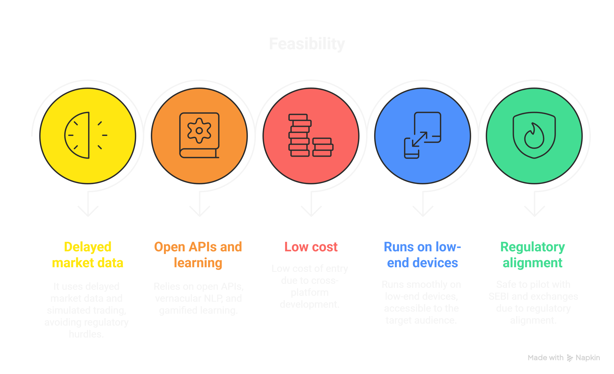
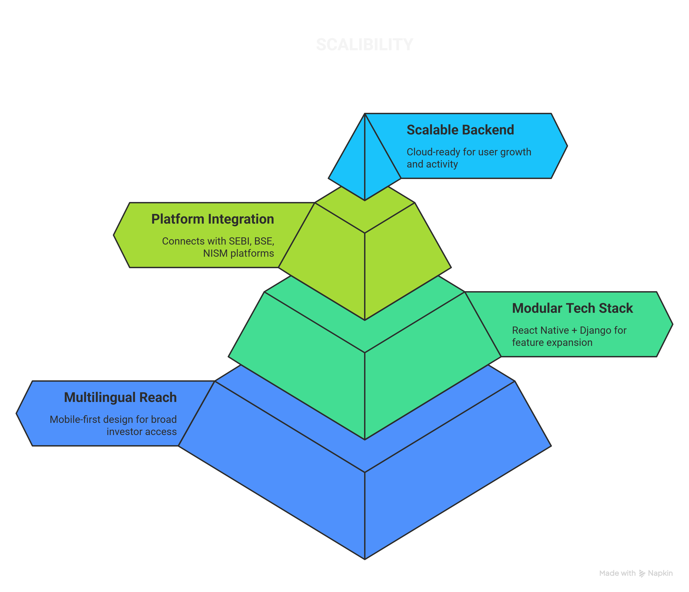
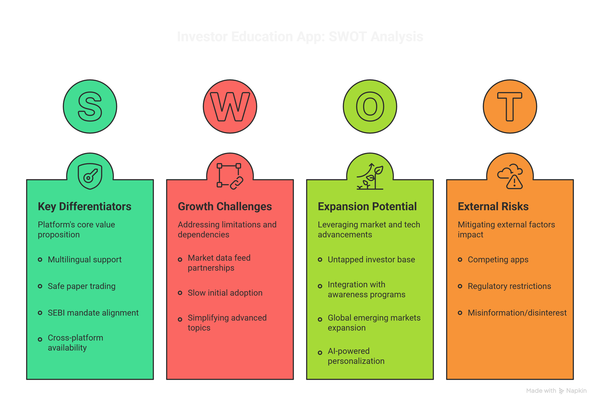
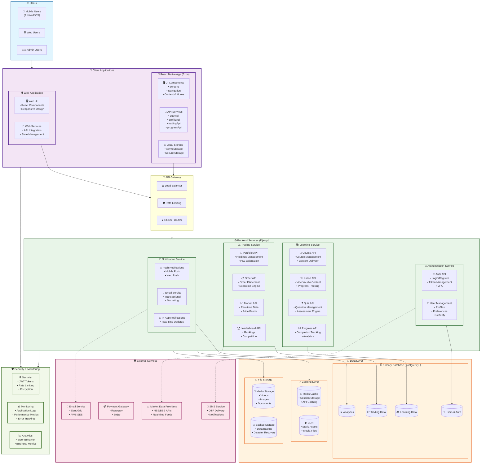

<div align="center">
  

# Investa - Multilingual Investor Education + Paper Trading Platform

> *Empowering retail investors in India with financial literacy through structured learning and simulated trading*

[](https://reactnative.dev)
[](https://expo.dev)
[](https://www.djangoproject.com/)
[](https://www.django-rest-framework.org/)
[](https://reactnative.dev)
[](https://github.com/your-username/investa)

---

</div>

## 🎯 **Overview**

### **Problem Statement**
Many retail investors in India lack the knowledge and tools to navigate the securities market effectively. Available financial education resources are often complex, fragmented, or limited to English, making it difficult for a large segment of the population to access reliable information. This leads to uninformed decisions, susceptibility to misinformation, and financial losses.
<div align="center">
  
</div>

### **Impact of the Problems**

<div align="center">
  
</div>

---

## ✨ **Solution Features**
Investa is a multilingual, interactive app that empowers retail investors with financial literacy, simulated trading, and regulatory awareness. It combines engaging tutorials, quizzes, and paper trading with vernacular support, making market knowledge accessible, safe, and practical for first-time and experienced investors alike.

<div align="center">
  
</div>
The app offers learning modules on stock market basics, quizzes with progress tracking, simulated trading with delayed data, and a personalized dashboard. Unique features include vernacular translation of SEBI updates, gamified achievements, and AI-powered summaries that simplify complex regulations for everyday investors.
---

## 👥 **Target Audience**

<div align="center">
  
</div>

---

## ✅ **Feasibility**
Built with a cross-platform tech stack, Investa ensures cost-effective and reliable deployment. By using delayed market data and simulated trading, it avoids regulatory hurdles. Its lightweight design makes it accessible even on low-end devices, ensuring inclusivity and real-world implementability.
<div align="center">
  
</div>

---

## 📈 **Scalability**
Investa is designed for mass adoption with its mobile-first, multilingual, and modular architecture. It can scale across millions of users, integrate seamlessly with SEBI and exchange platforms, and expand content to cover new asset classes like bonds, ETFs, and mutual funds.
<div align="center">
  
</div>

## **SWOT**
Investa’s strengths lie in its multilingual support, safe simulations, and SEBI alignment. While adoption challenges and data dependencies exist, it has vast opportunities in untapped markets and future AI integration. Competing apps and regulatory restrictions pose threats, but its unique value ensures resilience.
<div align="center">
  
</div>


---

## 🏗️ **Architecture Overview**



---

## 📁 **Monorepo Structure**

```
Investa/
├── 📱 InvestaApp/                    # React Native (Expo) app
│   ├── src/
│   │   ├── 🧭 navigation/            # AppNavigator, stacks, tabs
│   │   ├── 🖥️ screens/               # Auth/Main/Course/Trading screens
│   │   ├── 🔌 services/              # API clients
│   │   └── 🔗 context/ hooks/        # Auth and data hooks
│   ├── App.tsx, app.json             # App entry & metadata
│   └── package.json                  # Frontend dependencies
├── ⚙️ investa_backend/               # Django project
│   ├── api/                          # DRF app (models, serializers, views, urls)
│   │   ├── 🗄️ models/                # learning, trading, notifications, privacy, security, user
│   │   ├── 📝 serializers/           # per domain
│   │   ├── 🌐 views/ urls/           # endpoints
│   │   └── 🔄 migrations/            # DO commit these
│   ├── investa_backend/              # Project settings & root urls
│   ├── manage.py                     # Django management
│   ├── populate_sample_data.py       # Sample data seeding
│   ├── create_test_user.py           # Convenience script
│   ├── reset_test_user.py            # Convenience script
│   └── requirements.txt              # Backend dependencies
└── 📖 README.md
```

---

## 🚀 **Quickstart**

### 🔧 **Backend (Django)**
```bash
cd investa_backend
python -m venv venv && source venv/bin/activate  # Windows: venv\Scripts\activate
pip install -r requirements.txt
python manage.py migrate
python pouplate_sample_data.py # add some sample data to make it run and work
python manage.py runserver 0.0.0.0:8000    # Bind to all interfaces for devices
```

### 📱 **Frontend (Expo)**
```bash
cd InvestaApp
npm install
npx expo install       # ensures compatible native deps
npx expo doctor        # verify environment

# Set API base URL for device connectivity
$env:EXPO_PUBLIC_API_BASE_URL="http://YOUR_PC_LAN_IP:8000/api/"
npx expo start --clear
```

### 📱 **Open on Device/Emulator**
- 🤖 **Android:** `npm run android`
- 🍎 **iOS (macOS):** `npm run ios`
- 🌐 **Web:** `npm run web`

> 💡 **Tip:** Ensure phone and computer are on the same network when using Expo Go. Also make sure that both IP matches and works with each other and add them in env variables, otherwise it will not able to make pai calls and fails.

---


## 🔌 **API Examples**

### 🔐 **Authentication**
**Request:**
```bash
curl -X POST http://localhost:8000/api/auth/login/ \
  -H "Content-Type: application/json" \
  -d '{"username":"testuser","password":"password"}'
```

**Response:**
```json
{
  "token": "<drf-token>",
  "profile": {
    "id": 1,
    "username": "testuser",
    "language": "en"
  }
}
```

### 📚 **Courses**
**Request:**
```bash
curl http://localhost:8000/api/courses/
```

**Response:**
```json
[
  {
    "id": 1,
    "title": "Investing Basics",
    "language": { "code": "en", "name": "English" },
    "estimated_duration": 120
  }
]
```

### 📝 **Lessons → Mark Completed**
**Request:**
```bash
curl -X POST http://localhost:8000/api/lessons/1/mark_completed/ \
  -H "Authorization: Token <drf-token>"
```

**Response:**
```json
{ "status": "ok", "lesson": 1, "completed": true }
```

### 💹 **Trading — Portfolio Summary**
**Request:**
```bash
curl http://localhost:8000/api/trades/portfolio_summary/ \
  -H "Authorization: Token <drf-token>"
```

**Response:**
```json
{ "value": 125840, "pnl_percent": 0.248, "holdings": [] }
```

> 🔍 **Explore more endpoints** in `investa_backend/api/urls/` and serializer/view code under `investa_backend/api/`.

---

## 🧪 **Testing**

- 🧪 **Backend tests** can be added under `investa_backend/api/tests.py` or app-specific test modules.
- 📋 **Example smoke tests** included: `investa_backend/test_api.py`, `investa_backend/test_auth_flow.py`.
- 🚀 **Run tests:**
```bash
cd investa_backend
pytest  # or: python manage.py test
```

---

## 🤝 **Contributing**

We welcome contributions! Please:

- 🎯 Keep PRs focused and well-described
- 🎨 Match existing code style and formatting
- 🧪 Add tests where it makes sense (`python manage.py test` or `pytest`)

---

## 🔒 **Security**

- 🚫 **Never commit secrets;** use environment variables or a secrets manager
- 🛡️ **In production:** set `DEBUG=False`, configure `ALLOWED_HOSTS`, and harden CORS/CSRF

---

## 📄 **License**

This project is part of the **Investa hackathon project**. All rights reserved.

---

## 🙏 **Acknowledgments**

- 🎓 **SEBI and NISM** for investor education standards
- 🚀 **React Native, Expo, Django, and DRF** communities
- 👥 **Hackathon mentors, contributors, and testers**

---

<div align="center">

### 🌟 **Star this repository if it helped you!**

[](https://github.com/your-username/investa)
[](https://github.com/your-username/investa)
[](https://github.com/your-username/investa/issues)
[](https://github.com/your-username/investa/pulls)

**Made with ❤️ for the Indian investor community**

</div>
