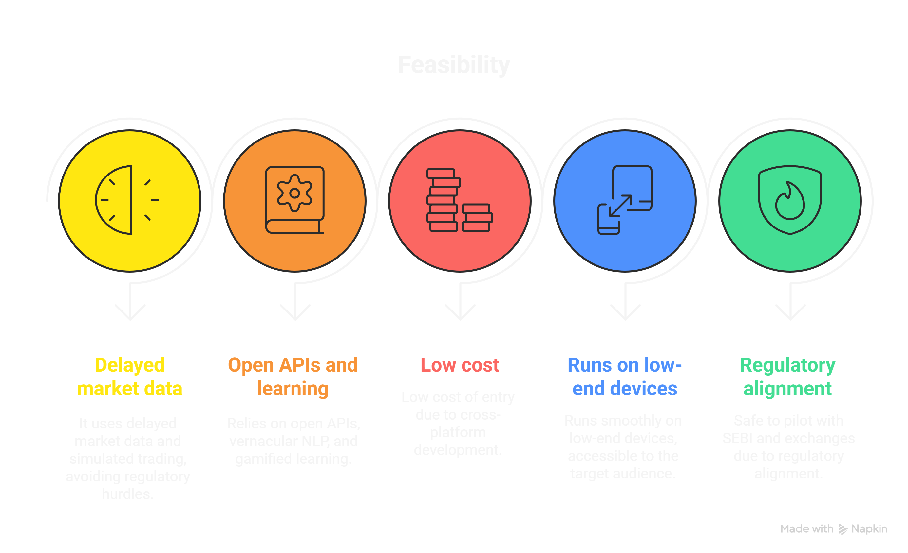
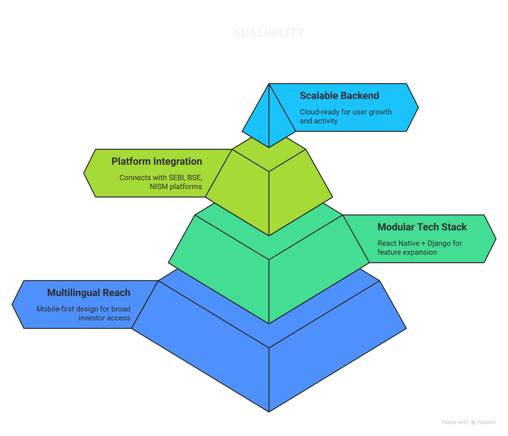
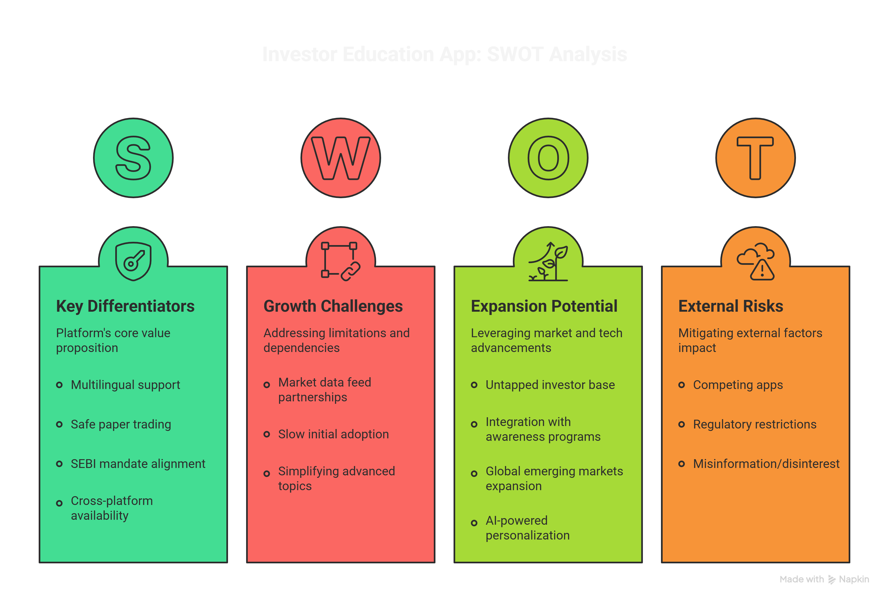
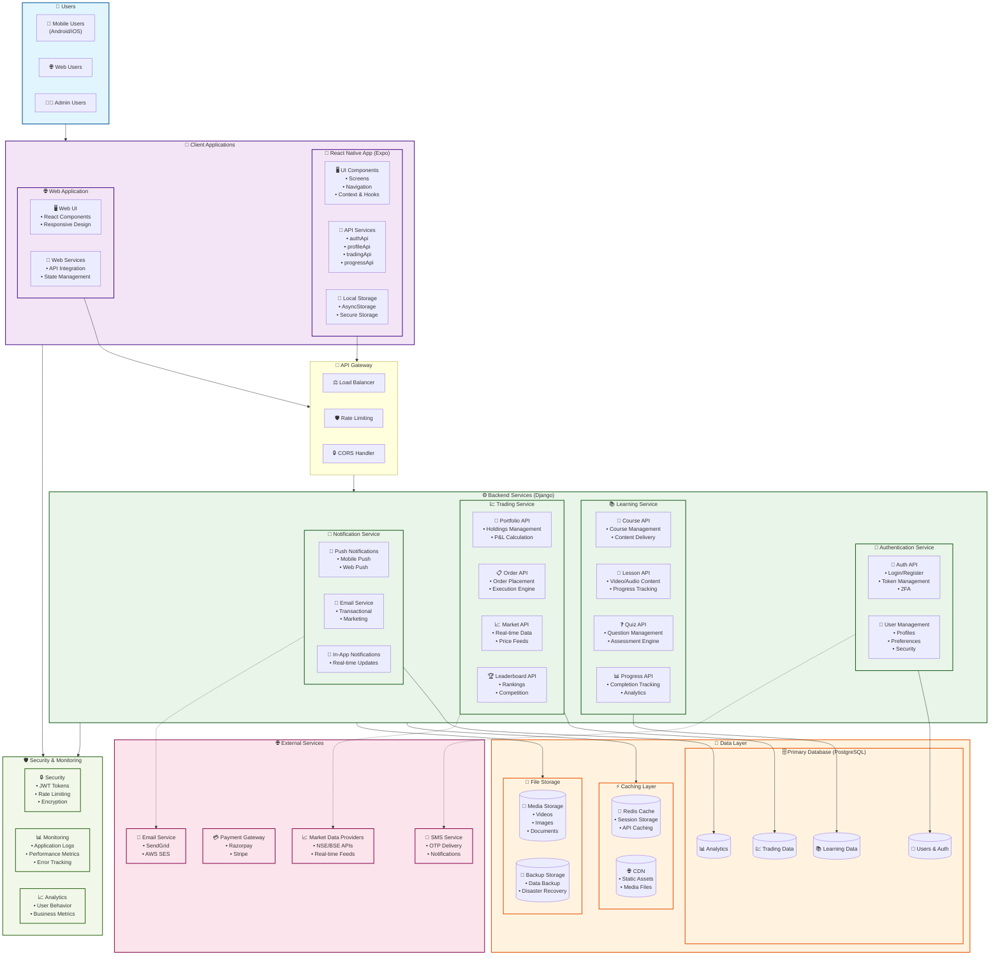

<div align="center">
  

# Investa - Multilingual Investor Education + Paper Trading Platform

> *Empowering retail investors in India with financial literacy through structured learning and simulated trading*

[](https://reactnative.dev)
[](https://expo.dev)
[](https://www.djangoproject.com/)
[](https://www.django-rest-framework.org/)
[](https://reactnative.dev)
[](https://github.com/your-username/investa)

---

</div>

## 🎯 **Overview**

### **Problem Statement**
Many retail investors in India lack the knowledge and tools to navigate the securities market effectively. Available financial education resources are often complex, fragmented, or limited to English, making it difficult for a large segment of the population to access reliable information. This leads to uninformed decisions, susceptibility to misinformation, and financial losses.
<div align="center">
  
</div>

### **Impact of the Problems**

<div align="center">
  
</div>

---

## ✨ **Solution Features**
Investa is a multilingual, interactive app that empowers retail investors with financial literacy, simulated trading, and regulatory awareness. It combines engaging tutorials, quizzes, and paper trading with vernacular support, making market knowledge accessible, safe, and practical for first-time and experienced investors alike.

<div align="center">
  
</div>
The app offers learning modules on stock market basics, quizzes with progress tracking, simulated trading with delayed data, and a personalized dashboard. Unique features include vernacular translation of SEBI updates, gamified achievements, and AI-powered summaries that simplify complex regulations for everyday investors.
---

## 👥 **Target Audience**

<div align="center">
  
</div>

---

## ✅ **Feasibility**
Built with a cross-platform tech stack, Investa ensures cost-effective and reliable deployment. By using delayed market data and simulated trading, it avoids regulatory hurdles. Its lightweight design makes it accessible even on low-end devices, ensuring inclusivity and real-world implementability.
<div align="center">
  
</div>

---

## 📈 **Scalability**
Investa is designed for mass adoption with its mobile-first, multilingual, and modular architecture. It can scale across millions of users, integrate seamlessly with SEBI and exchange platforms, and expand content to cover new asset classes like bonds, ETFs, and mutual funds.
<div align="center">
  
</div>

## **SWOT**
Investa’s strengths lie in its multilingual support, safe simulations, and SEBI alignment. While adoption challenges and data dependencies exist, it has vast opportunities in untapped markets and future AI integration. Competing apps and regulatory restrictions pose threats, but its unique value ensures resilience.
<div align="center">
  
</div>


---

## 🏗️ **Architecture Overview**


```mermaid
flowchart TB
  %% User Layer
  subgraph Users["👥 Users"]
    Mobile["📱 Mobile Users\n(Android/iOS)"]
    Web["🌐 Web Users"]
    Admin["👨‍💼 Admin Users"]
  end

  %% Client Applications
  subgraph ClientLayer["📱 Client Applications"]
    subgraph MobileApp["📱 React Native App (Expo)"]
      UI["🖥️ UI Components\n• Screens\n• Navigation\n• Context & Hooks"]
      Services["🔌 API Services\n• authApi\n• profileApi\n• tradingApi\n• progressApi"]
      Storage["💾 Local Storage\n• AsyncStorage\n• Secure Storage"]
    end
    
    subgraph WebApp["🌐 Web Application"]
      WebUI["🖥️ Web UI\n• React Components\n• Responsive Design"]
      WebServices["🔌 Web Services\n• API Integration\n• State Management"]
    end
  end

  %% API Gateway & Load Balancer
  subgraph Gateway["🚪 API Gateway"]
    LoadBalancer["⚖️ Load Balancer"]
    RateLimit["🛡️ Rate Limiting"]
    CORS["🔒 CORS Handler"]
  end

  %% Backend Services
  subgraph BackendServices["⚙️ Backend Services (Django)"]
    subgraph AuthService["🔐 Authentication Service"]
      AuthAPI["🔑 Auth API\n• Login/Register\n• Token Management\n• 2FA"]
      UserMgmt["👤 User Management\n• Profiles\n• Preferences\n• Security"]
    end
    
    subgraph LearningService["📚 Learning Service"]
      CourseAPI["📖 Course API\n• Course Management\n• Content Delivery"]
      LessonAPI["📝 Lesson API\n• Video/Audio Content\n• Progress Tracking"]
      QuizAPI["❓ Quiz API\n• Question Management\n• Assessment Engine"]
      ProgressAPI["📊 Progress API\n• Completion Tracking\n• Analytics"]
    end
    
    subgraph TradingService["💹 Trading Service"]
      PortfolioAPI["💼 Portfolio API\n• Holdings Management\n• P&L Calculation"]
      OrderAPI["📋 Order API\n• Order Placement\n• Execution Engine"]
      MarketAPI["📈 Market API\n• Real-time Data\n• Price Feeds"]
      LeaderboardAPI["🏆 Leaderboard API\n• Rankings\n• Competition"]
    end
    
    subgraph NotificationService["🔔 Notification Service"]
      PushAPI["📲 Push Notifications\n• Mobile Push\n• Web Push"]
      EmailAPI["📧 Email Service\n• Transactional\n• Marketing"]
      InAppAPI["🔔 In-App Notifications\n• Real-time Updates"]
    end
  end

  %% Data Layer
  subgraph DataLayer["💾 Data Layer"]
    subgraph PrimaryDB["🗄️ Primary Database (PostgreSQL)"]
      UserDB[("👤 Users & Auth")]
      LearningDB[("📚 Learning Data")]
      TradingDB[("💹 Trading Data")]
      AnalyticsDB[("📊 Analytics")]
    end
    
    subgraph CacheLayer["⚡ Caching Layer"]
      Redis[("🔄 Redis Cache\n• Session Storage\n• API Caching")]
      CDN[("🌐 CDN\n• Static Assets\n• Media Files")]
    end
    
    subgraph FileStorage["📁 File Storage"]
      MediaStorage[("🎥 Media Storage\n• Videos\n• Images\n• Documents")]
      BackupStorage[("💾 Backup Storage\n• Data Backup\n• Disaster Recovery")]
    end
  end

  %% External Services
  subgraph ExternalServices["🌐 External Services"]
    MarketData["📈 Market Data Providers\n• NSE/BSE APIs\n• Real-time Feeds"]
    PaymentGateway["💳 Payment Gateway\n• Razorpay\n• Stripe"]
    SMSService["📱 SMS Service\n• OTP Delivery\n• Notifications"]
    EmailService["📧 Email Service\n• SendGrid\n• AWS SES"]
  end

  %% Security & Monitoring
  subgraph SecurityMonitoring["🛡️ Security & Monitoring"]
    Security["🔒 Security\n• JWT Tokens\n• Rate Limiting\n• Encryption"]
    Monitoring["📊 Monitoring\n• Application Logs\n• Performance Metrics\n• Error Tracking"]
    Analytics["📈 Analytics\n• User Behavior\n• Business Metrics"]
  end

  %% Connections
  Users --> ClientLayer
  MobileApp --> Gateway
  WebApp --> Gateway
  Gateway --> BackendServices
  
  AuthService --> UserDB
  LearningService --> LearningDB
  TradingService --> TradingDB
  NotificationService --> AnalyticsDB
  
  BackendServices --> CacheLayer
  BackendServices --> FileStorage
  
  TradingService -.-> MarketData
  AuthService -.-> SMSService
  NotificationService -.-> EmailService
  
  BackendServices --> SecurityMonitoring
  ClientLayer --> SecurityMonitoring

  %% Styling
  classDef userClass fill:#e1f5fe,stroke:#01579b,stroke-width:2px
  classDef clientClass fill:#f3e5f5,stroke:#4a148c,stroke-width:2px
  classDef backendClass fill:#e8f5e8,stroke:#1b5e20,stroke-width:2px
  classDef dataClass fill:#fff3e0,stroke:#e65100,stroke-width:2px
  classDef externalClass fill:#fce4ec,stroke:#880e4f,stroke-width:2px
  classDef securityClass fill:#f1f8e9,stroke:#33691e,stroke-width:2px

  class Users userClass
  class ClientLayer,MobileApp,WebApp clientClass
  class BackendServices,AuthService,LearningService,TradingService,NotificationService backendClass
  class DataLayer,PrimaryDB,CacheLayer,FileStorage dataClass
  class ExternalServices,MarketData,PaymentGateway,SMSService,EmailService externalClass
  class SecurityMonitoring,Security,Monitoring,Analytics securityClass
```

---

## 📁 **Monorepo Structure**

```
Investa/
├── 📱 InvestaApp/                    # React Native (Expo) app
│   ├── src/
│   │   ├── 🧭 navigation/            # AppNavigator, stacks, tabs
│   │   ├── 🖥️ screens/               # Auth/Main/Course/Trading screens
│   │   ├── 🔌 services/              # API clients
│   │   └── 🔗 context/ hooks/        # Auth and data hooks
│   ├── App.tsx, app.json             # App entry & metadata
│   └── package.json                  # Frontend dependencies
├── ⚙️ investa_backend/               # Django project
│   ├── api/                          # DRF app (models, serializers, views, urls)
│   │   ├── 🗄️ models/                # learning, trading, notifications, privacy, security, user
│   │   ├── 📝 serializers/           # per domain
│   │   ├── 🌐 views/ urls/           # endpoints
│   │   └── 🔄 migrations/            # DO commit these
│   ├── investa_backend/              # Project settings & root urls
│   ├── manage.py                     # Django management
│   ├── populate_sample_data.py       # Sample data seeding
│   ├── create_test_user.py           # Convenience script
│   ├── reset_test_user.py            # Convenience script
│   └── requirements.txt              # Backend dependencies
└── 📖 README.md
```

---

## 🚀 **Quickstart**

### 🔧 **Backend (Django)**
```bash
cd investa_backend
python -m venv venv && source venv/bin/activate  # Windows: venv\Scripts\activate
pip install -r requirements.txt
python manage.py migrate
python manage.py create_test_user  # Create test user (testuser@example.com / testpass123)
python manage.py populate_sample_data  # Seed courses, stocks, quizzes, achievements
python manage.py runserver 0.0.0.0:8000    # Bind to all interfaces for devices
```

### 🐳 **Docker (Production)**
```bash
# Copy and configure environment variables
cp .env.example .env  # Edit with your values

# Build and run

docker compose up --build

# Run migrations inside the container
docker compose exec backend python manage.py migrate
docker compose exec backend python manage.py populate_sample_data
```

### 📱 **Frontend (Expo)**
```bash
cd InvestaApp
npm install
npx expo install       # ensures compatible native deps
npx expo doctor        # verify environment

# Set API base URL for device connectivity
$env:EXPO_PUBLIC_API_BASE_URL="http://YOUR_PC_LAN_IP:8000/api/"
npx expo start --clear
```

### 📱 **Open on Device/Emulator**
- 🤖 **Android:** `npm run android`
- 🍎 **iOS (macOS):** `npm run ios`
- 🌐 **Web:** `npm run web`

> 💡 **Tip:** Ensure phone and computer are on the same network when using Expo Go. Also make sure that both IP matches and works with each other and add them in env variables, otherwise it will not able to make pai calls and fails.

### 🚀 **Release an Android APK (CI)**

The `release` workflow (`/.github/workflows/release.yml`) builds a signed APK and publishes a GitHub release. Trigger it in one of two ways:

1. **Push a version tag:** `git tag v0.1.0 && git push origin v0.1.0`
2. **Manually:** GitHub → Actions → **Release Android APK** → *Run workflow* (enter version, e.g. `0.1.0`)

The APK (`InvestaApp-v<version>.apk`) is attached to the GitHub release. The app version in `InvestaApp/app.json` must match the release version.

> 🔐 **Release signing:** by default the APK is signed with the debug keystore (fine for sideloading). For a Play-Store-ready build, add repo secrets `ANDROID_KEYSTORE_BASE64`, `ANDROID_KEYSTORE_PASSWORD`, `ANDROID_KEY_ALIAS`, and `ANDROID_KEY_PASSWORD` — the workflow will sign with your release keystore automatically.

### 🐳 **Docker image registry (CI)**

The `docker` workflow (`/.github/workflows/docker.yml`) builds the backend image and pushes it to GitHub Container Registry (`ghcr.io/<owner>/Investa/investa-backend`) on every push to `main` and on version tags. Pull it with:

```bash
docker pull ghcr.io/<owner>/Investa/investa-backend:latest
```

---


## 🔌 **API Examples**

### 🔐 **Authentication**
**Request:**
```bash
curl -X POST http://localhost:8000/api/auth/login/ \
  -H "Content-Type: application/json" \
  -d '{"username":"testuser","password":"password"}'
```

**Response:**
```json
{
  "token": "<drf-token>",
  "profile": {
    "id": 1,
    "username": "testuser",
    "language": "en"
  }
}
```

### 📚 **Courses**
**Request:**
```bash
curl http://localhost:8000/api/courses/
```

**Response:**
```json
[
  {
    "id": 1,
    "title": "Investing Basics",
    "language": { "code": "en", "name": "English" },
    "estimated_duration": 120
  }
]
```

### 📝 **Lessons → Mark Completed**
**Request:**
```bash
curl -X POST http://localhost:8000/api/lessons/1/mark_completed/ \
  -H "Authorization: Token <drf-token>"
```

**Response:**
```json
{ "status": "ok", "lesson": 1, "completed": true }
```

### 💹 **Trading — Portfolio Summary**
**Request:**
```bash
curl http://localhost:8000/api/trades/portfolio_summary/ \
  -H "Authorization: Token <drf-token>"
```

**Response:**
```json
{ "value": 125840, "pnl_percent": 0.248, "holdings": [] }
```

> 🔍 **Explore more endpoints** in `investa_backend/api/urls/` and serializer/view code under `investa_backend/api/`.

---

## 🧪 **Testing**

- 🧪 **Backend tests** can be added under `investa_backend/api/tests.py` or app-specific test modules.
- 🚀 **Run tests:**
```bash
cd investa_backend
python manage.py test  # or: pytest
```

## 🚢 **Deployment**

### Production Checklist
- [ ] Generate a secure `INVESTA_SECRET_KEY`
- [ ] Set `INVESTA_DEBUG=False`
- [ ] Configure `INVESTA_ALLOWED_HOSTS` for your domain
- [ ] Set up `INVESTA_CORS_ORIGINS` for your frontend URL
- [ ] Run `python manage.py collectstatic`
- [ ] Set up a PostgreSQL database (recommended for production)
- [ ] Configure a reverse proxy (nginx/caddy) for SSL termination

### Docker Deployment
```bash
docker compose up -d --build
docker compose exec backend python manage.py migrate
docker compose exec backend python manage.py populate_sample_data
docker compose exec backend python manage.py createsuperuser  # Create admin user
```

---

## 🤝 **Contributing**

We welcome contributions! Please:

- 🎯 Keep PRs focused and well-described
- 🎨 Match existing code style and formatting
- 🧪 Add tests where it makes sense (`python manage.py test` or `pytest`)

---

## 🔒 **Security**

- 🚫 **Never commit secrets;** use environment variables or a secrets manager
- 🛡️ **In production:** set `DEBUG=False`, configure `ALLOWED_HOSTS`, and harden CORS/CSRF

---

## 📄 **License**

This project is part of the **Investa hackathon project**. All rights reserved.

---

## 🙏 **Acknowledgments**

- 🎓 **SEBI and NISM** for investor education standards
- 🚀 **React Native, Expo, Django, and DRF** communities
- 👥 **Hackathon mentors, contributors, and testers**

---

<div align="center">

### 🌟 **Star this repository if it helped you!**

[](https://github.com/your-username/investa)
[](https://github.com/your-username/investa)
[](https://github.com/your-username/investa/issues)
[](https://github.com/your-username/investa/pulls)

**Made with ❤️ for the Indian investor community**

</div>
